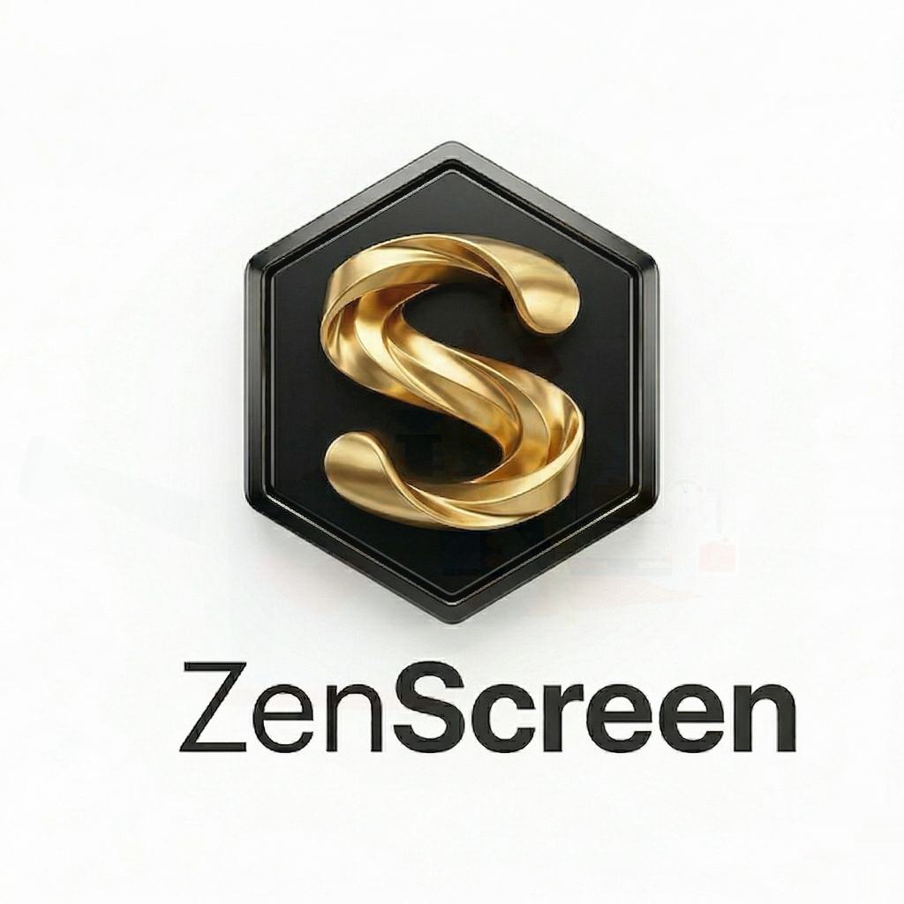
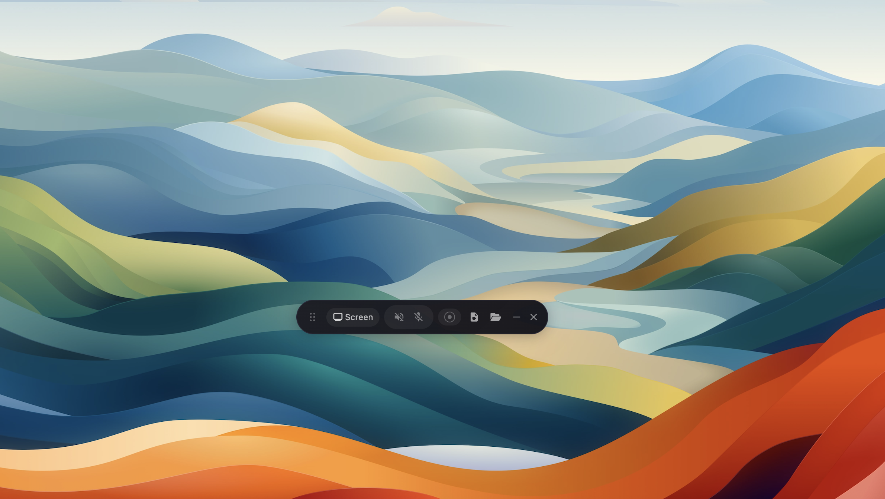
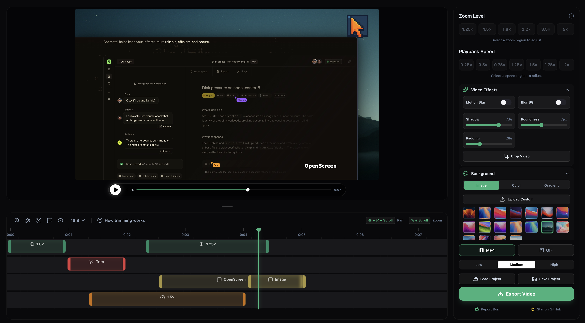

> [!WARNING]
> 该项目仍处于测试阶段，可能存在一些 Bug（但希望你能有良好的体验！）。

<p align="center">
  
</p>

# <p align="center">ZenScreen</p>

<p align="center"><strong>ZenScreen 是 Screen Studio 的免费开源替代方案——禅系录屏编辑器。</strong></p>

如果你不想为 Screen Studio 每月支付 29 美元，但又想要一个更简洁的版本，能完成大多数人需要的功能——制作精美的产品演示和教程视频——那么这个免费应用就是为你准备的。ZenScreen 并不提供 Screen Studio 的所有功能，但基本功能一应俱全！

Screen Studio 是一款非常棒的产品，这绝对不是它的 1:1 克隆。ZenScreen 是一个更简洁的方案，只保留核心功能，适合想要自主控制且不想付费的用户。如果你需要所有高级功能，最好的选择是支持 Screen Studio（他们真的很棒，哈哈）。但如果你只是想要一个免费（没有套路）且开源的工具，这个项目就能满足需求！

ZenScreen 100% 免费用于个人和商业用途。使用它、修改它、分发它。

<p align="center">
	
	
</p>

## 核心功能

- 录制整个屏幕或特定窗口
- 添加自动缩放或手动缩放（可自定义缩放深度）
- 录制麦克风音频和系统音频
- 自定义缩放的持续时间和位置
- 裁剪视频录制内容以隐藏部分区域
- 在壁纸、纯色、渐变或自定义背景之间选择
- 运动模糊效果，让平移和缩放更流畅
- 添加标注（文本、箭头、图片）
- 剪辑视频片段
- 自定义不同片段的播放速度
- 以不同的宽高比和分辨率导出

## 安装

从 [GitHub Releases](https://github.com/hwdemtv/zenscreen/releases) 页面下载适合你平台的最新安装程序。

## 使用说明

请参考详细的 **[中文使用说明书](./docs/usage_zh.md)** 了解如何进行录制、剪辑和导出。

### 快捷键预览
- **`Space`**: 播放 / 暂停
- **`T`**: 标记要剪掉的区域
- **`Ctrl+S`**: 保存项目
- **`Ctrl+Z`**: 撤销

---

## 安装注意事项 (Windows / macOS / Linux)

### Windows

由于本应用目前尚未配置开发者证书签名，Windows 系统可能会出现以下情况：

1. **SmartScreen 拦截**：启动安装程序或绿色版时，可能会弹出“已保护你的电脑”提示。
   - **解决方法**：点击“更多信息” -> “仍要运行”。
2. **管理员权限**：部分录制功能（如捕获特定高权限窗口）可能需要以“管理员身份运行” ZenScreen。
3. **绿色版 (Portable)**：绿色版解压即可使用，适合不想安装的用户。但请注意，绿色版无法实现静默自动更新，建议手动关注新版本。


如果你遇到 macOS Gatekeeper 阻止应用运行的问题（因为该应用没有开发者证书），你可以在安装后在终端运行以下命令来绕过：

```bash
xattr -rd com.apple.quarantine /Applications/ZenScreen.app
```

注意：需要在 **系统设置 > 隐私与安全性** 中为你的终端授予"完全磁盘访问"权限，然后运行上述命令。

运行此命令后，前往 **系统偏好设置 > 安全性与隐私**，授予"屏幕录制"和"辅助功能"所需的权限。权限授予后，即可启动应用。

### Linux

从发布页面下载 `.AppImage` 文件。添加可执行权限并运行：

```bash
chmod +x ZenScreen-Linux-*.AppImage
./ZenScreen-Linux-*.AppImage
```

根据你的桌面环境，可能需要授予屏幕录制权限。

**注意：** 如果应用因"沙盒"错误无法启动，请使用 --no-sandbox 参数运行：
```bash
./ZenScreen-Linux-*.AppImage --no-sandbox
```

### 局限性

系统音频捕获依赖 Electron 的 [desktopCapturer](https://www.electronjs.org/docs/latest/api/desktop-capturer)，存在一些平台特定的限制：

- **macOS**：需要 macOS 13+。在 macOS 14.2+ 上，系统会提示你授予音频捕获权限。macOS 12 及以下版本不支持系统音频捕获（麦克风仍然可用）。
- **Windows**：开箱即用。
- **Linux**：需要 PipeWire（Ubuntu 22.04+、Fedora 34+ 默认安装）。较旧的仅 PulseAudio 环境可能不支持系统音频捕获（麦克风应该仍然可用）。

## 技术栈

- Electron
- React
- TypeScript
- Vite
- [PixiJS](https://pixijs.com/) - 高性能 2D 渲染引擎
- [dnd-timeline](https://github.com/vobs-io/dnd-timeline) - 拖拽式时间轴组件
- [WebCodecs API](https://developer.mozilla.org/en-US/docs/Web/API/WebCodecs_API) - 低延迟音视频处理

## 架构亮点

- **高性能预览**: 使用 PixiJS WebGL 引擎进行视频合成，支持实时动态模糊、缩放和平移，确保 60fps 的流畅编辑体验。
- **现代导出引擎**: 基于 WebCodecs API 实现逐帧解码与加速编码，避开传统的 FFmpeg WASM 性能瓶颈，支持视觉无损导出。
- **非破坏性编辑**: 所有的裁剪、缩放和批注操作均作为元数据存储（`.zenscreen` 项目文件），原始视频素材始终保持不变。
- **智能光标追踪**: 录制过程中以 10Hz 采样光标位置，编辑器可根据光标路径提供自动缩放建议。

## 致谢

本项目 Fork 自 [OpenScreen](https://github.com/hwdemtv/zenscreen)，感谢原作者的开源贡献。

## 许可证

本项目基于 [MIT 许可证](./LICENSE) 授权。
